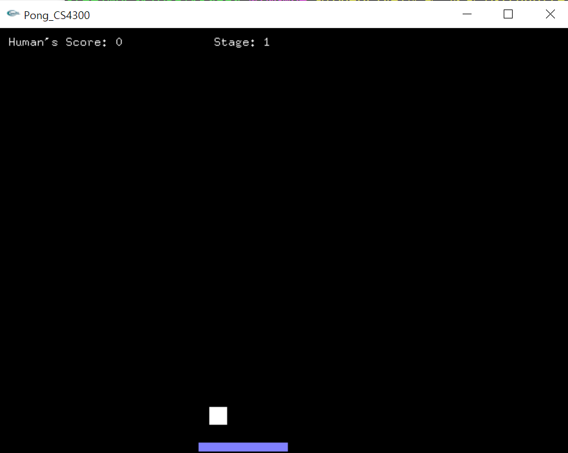
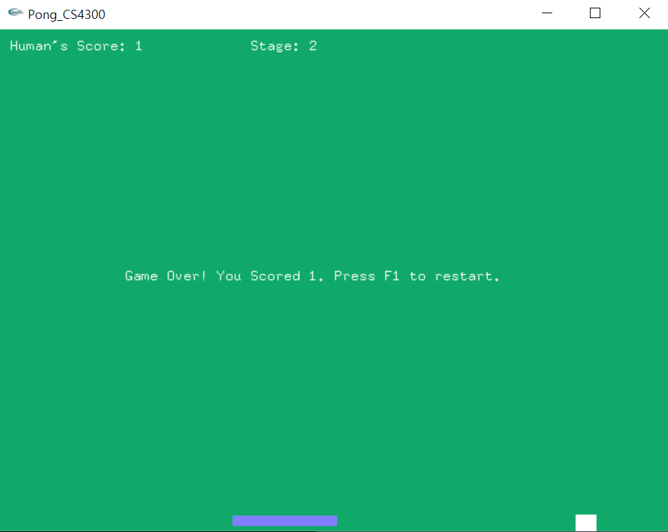
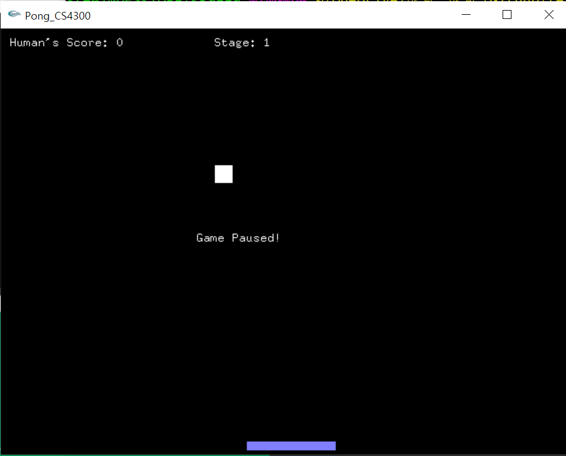

## Pong

## How to run?
``` g++ -o test -Wall main.cpp -mwindows glut32.lib -lopengl32 -lglu32 ```  

## Good to know?
Basic Keys: ESC to pause the game, press ESC again to resume  
Press F1 to restart the game when you lose the game  
Move mouse to move your horizontal bar  

## Preview




## Youtube link:
<p align="center">
	<iframe width="560" height="315" src="https://www.youtube.com/embed/K3wUXRtxz-0" title="YouTube video player" frameborder="0" allow="accelerometer; autoplay; clipboard-write; encrypted-media; gyroscope; picture-in-picture" allowfullscreen></iframe>
</p>

#### External resources
I used GL/glut.h library.  
It can be downloaded [here](https://w3.cs.jmu.edu/bernstdh/web/common/help/cpp_mingw-glut-setup.php)

Reference: [https://www3.ntu.edu.sg/home/ehchua/programming/opengl/cg_introduction.html](https://www3.ntu.edu.sg/home/ehchua/programming/opengl/cg_introduction.html)