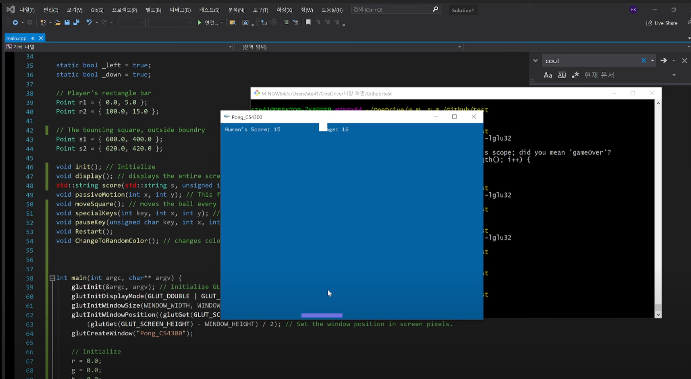

## Pong

### How to run?
``` g++ -o test -Wall main.cpp -mwindows glut32.lib -lopengl32 -lglu32 ```  

### Good to know?
Basic Keys: ESC to pause the game, press ESC again to resume  
Press F1 to restart the game when you lose the game  
Move mouse to move your horizontal bar  

### Preview


### Youtube link:
[](https://www.youtube.com/watch?v=K3wUXRtxz-0)

#### External resources
I used GL/glut.h library.  
It can be downloaded [here](https://w3.cs.jmu.edu/bernstdh/web/common/help/cpp_mingw-glut-setup.php)

Reference: [https://www3.ntu.edu.sg/home/ehchua/programming/opengl/cg_introduction.html](https://www3.ntu.edu.sg/home/ehchua/programming/opengl/cg_introduction.html)